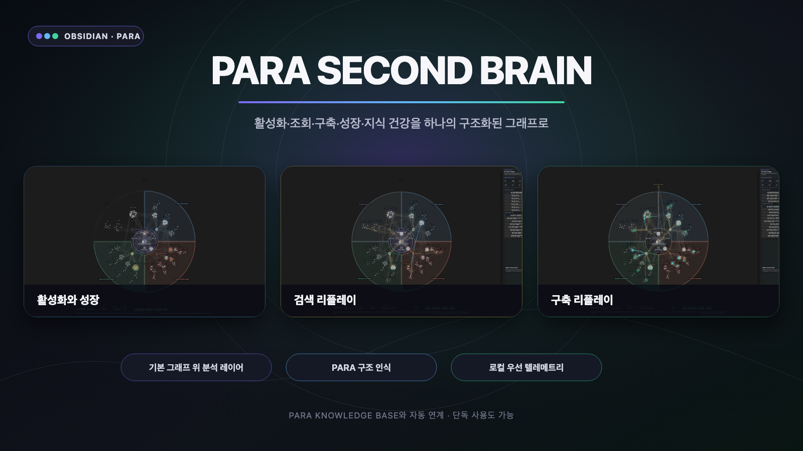

# PARA Second Brain

[English](README.md) | [한국어](README.ko.md)



PARA Second Brain은 Obsidian 기본 그래프 위에 PARA 구조, 인덱스와 척수 노드, 활동·성장 변화, 검색 리플레이, 구축 리플레이, 지식 건강 필터와 운영 메트릭을 덧붙이는 데스크톱 플러그인입니다.

그래프의 연결 관계를 새로 만드는 도구가 아닙니다. Obsidian Core Graph를 열고, 설정된 범위와 배치를 적용하고, 기본 노드를 의미 있는 위치에 고정한 다음 분석 레이어와 애니메이션을 그 위에 표시합니다.

## 호환성과 독립 사용

[PARA Knowledge Base](https://github.com/ernestolee13/para-knowledge-base)는 권장 연계 플러그인이지만 필수 의존성은 아닙니다.

- **함께 사용할 때:** `.para-kb/config.json`에서 PARA 루트, 인덱스, 척수 문서, 제외 경로와 텔레메트리 위치를 자동으로 읽습니다. `kb-query`와 `kb-ingest`가 남긴 개인정보 비포함 JSONL을 별도 설정 없이 리플레이할 수 있습니다.
- **단독으로 사용할 때:** 번호형 LLM wiki PARA, 표준 PARA, 완전 사용자 정의 프로필 중 하나를 선택할 수 있습니다. Claude Code, Codex, PARA Knowledge Base 없이도 동작합니다.
- **텔레메트리가 없을 때:** 구조, PARA 영역, 인덱스, 활동, 성장, 스냅샷, 지식 건강 기능은 그대로 사용할 수 있습니다. 기록이 필요한 검색·구축 리플레이만 비활성화됩니다.

두 프로젝트는 코드를 서로 포함하지 않습니다. 버전이 명시된 vault 설정과 개인정보를 저장하지 않는 텔레메트리 규격만 공유하므로 각각 독립적으로 설치·배포할 수 있습니다.

## 핵심 기능

- PARA 4영역과 1차 폴더 클러스터를 유지하는 안정적인 기본 배치
- 전체 인덱스, 카테고리 인덱스, 스키마·메모리·가이드 문서로 구성되는 의미 중심축
- 활동, 성장, 검색 리플레이, 구축 리플레이, 구축 건강, 지식 감사 렌즈
- 기간 또는 최근 개수 기준 리플레이와 소요시간 가중 동시 트레이스
- 개별 트레이스 상세와 선택 집합의 평균 시간, 토큰, 문서, 링크, PARA 도달 범위 통계
- orphan, 비활성, 미사용, 인덱스 이탈 등 지식 건강 필터
- 구조 변화 비교를 위한 수동 스냅샷

## 화면 예시

### 활동과 성장


선택 기간에 생성된 문서와 구조 연결을 시간순으로 재생합니다. PARA 영역, 인덱스 허브, 중앙 코어는 유지되므로 어떤 영역이 성장했고 어디가 오랫동안 비활성인지 빠르게 확인할 수 있습니다.

### 검색 리플레이


기간 또는 최근 작업 개수를 기준으로 여러 검색을 동시에 시작하고, 기록된 소요시간에 맞춰 각 트레이스를 종료합니다. 그래프에서는 도달 영역과 문서를 보고, 우측 패널에서는 개별 검색의 시간·토큰·조회 문서·경로 및 전체 선택 통계를 확인합니다.

### 구축 리플레이


Inbox 또는 직접 요청에서 시작한 지식이 가이드와 인덱스를 거쳐 최종 PARA 위치에 정착하는 흐름을 보여줍니다. 빠른 배치, 여러 영역을 참고한 배치, 링크 추가, 판단이 여러 단계 오간 사례를 같은 그래프에서 비교할 수 있습니다.

## 설치

1. [최신 릴리스](https://github.com/ernestolee13/para-second-brain/releases/latest)에서 `manifest.json`, `main.js`, `styles.css`를 받습니다.
2. vault 설정 폴더 아래에 `plugins/llm-wiki-observatory/`를 만듭니다.
3. 세 파일을 해당 폴더에 복사합니다.
4. Obsidian을 다시 로드하고 커뮤니티 플러그인에서 **PARA Second Brain**을 활성화합니다.

설치 폴더 ID `llm-wiki-observatory`는 기존 프로토타입 설치와 설정을 이어받기 위해 유지합니다. 사용자에게 표시되는 제품명과 공개 저장소명은 **PARA Second Brain**입니다.

## 설정

**설정 → 커뮤니티 플러그인 → PARA Second Brain**에서 다음 소스를 선택할 수 있습니다.

- **PARA Knowledge Base v1:** `.para-kb/config.json`을 읽어 구조와 로그 위치를 자동 매핑합니다.
- **LLM wiki PARA:** `0. Common`, 번호형 PARA 루트, Inbox, `index.md`/`_index.md` 규칙을 사용합니다.
- **Standard PARA:** 번호가 없는 `Common`, `Projects`, `Areas`, `Resources`, `Archive`, `Inbox`를 사용합니다.
- **Custom:** 루트, 인덱스명, 척수 문서, 제외 경로, 텔레메트리 이벤트와 필드 별칭을 직접 지정합니다.

알 수 없는 텔레메트리 필드는 버리고, 질문·답변·노트 본문은 파싱하거나 저장하지 않습니다. 값이 기록되지 않은 시간과 토큰은 추정하지 않고 N/A로 유지합니다. 상세 규격은 [Telemetry schema](docs/telemetry-schema.md)를 참고하세요.

## 개발과 검증

Node.js 20 이상과 Obsidian 데스크톱 테스트 vault가 필요합니다.

```bash
npm ci
npm run check
npm run package:release
```

릴리스 패키지는 `release/para-second-brain-<version>/`에 생성됩니다. MIT License로 배포됩니다.
