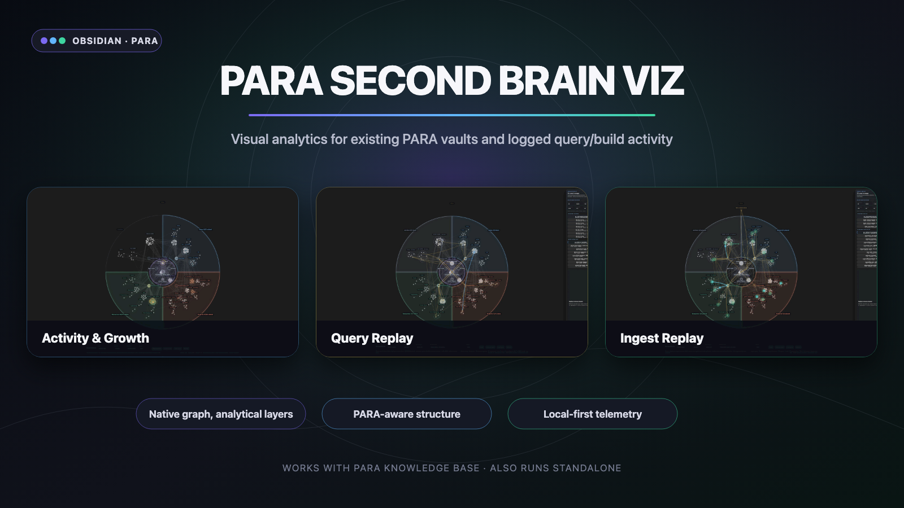
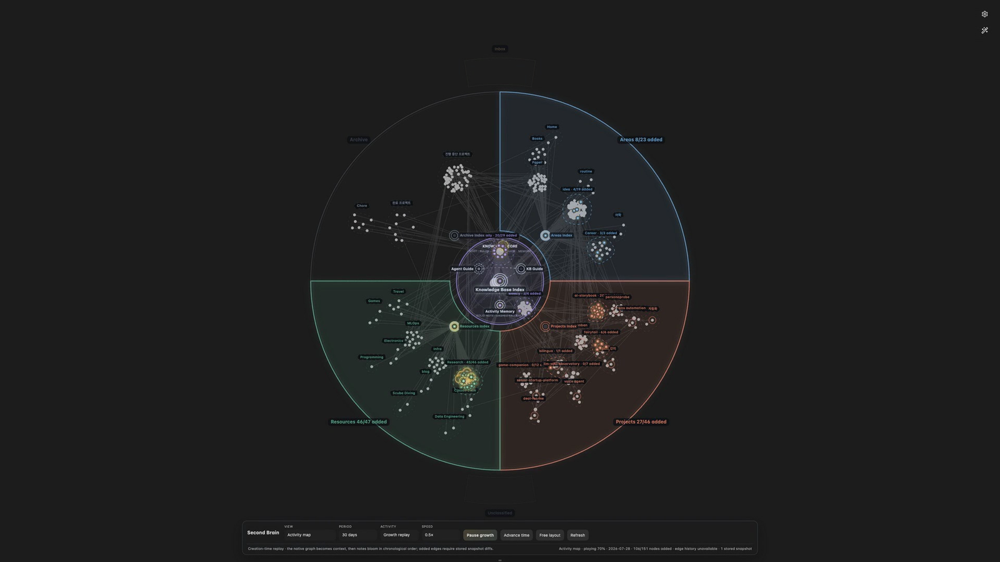
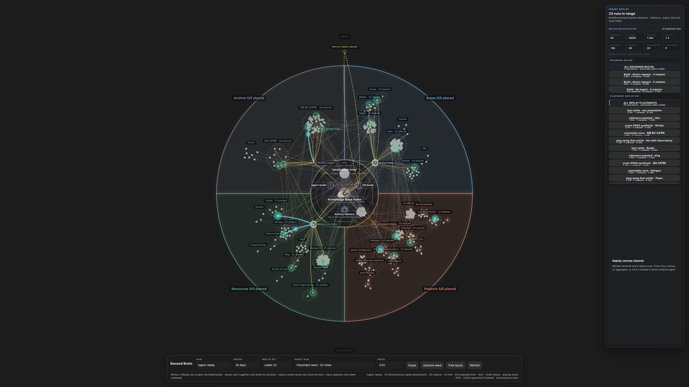

# PARA Second Brain Viz

[English](README.md) | [한국어](README.ko.md)



PARA Second Brain Viz is an Obsidian visual analytics plugin for an existing PARA vault: it maps the vault's current structure and, when knowledge-base tools such as PARA Knowledge Base provide privacy-safe query/build logs, turns them into replay, cost, reach, growth, and health insights. It does **not** build, rewrite, or query the knowledge base itself.

The plugin auto-detects the portable **PARA Knowledge Base v1** contract when a vault contains `.para-kb/config.json`. LLM wiki PARA, standard PARA, and fully custom profiles remain available for independent and legacy setups.

PARA Second Brain Viz is an independent, read-only consumer of the [PARA Knowledge Base](https://github.com/ernestolee13/para-knowledge-base) interoperability contract. It does not embed or import the producer plugin: the only integration boundary is the versioned vault config and privacy-safe JSONL telemetry format.

## Compatibility

PARA Knowledge Base is the recommended companion, not a dependency.

- **Used together:** Auto mode reads `.para-kb/config.json`, discovers the same PARA roots and indexes, and replays privacy-safe query/build telemetry without duplicate setup.
- **Used standalone:** Choose the numbered LLM wiki PARA profile, standard PARA profile, or fully custom roots, index names, spine notes, exclusions, and telemetry mappings. Claude Code, Codex, and PARA Knowledge Base are not required.
- **Used without telemetry:** Structure, PARA territories, indexes, activity, growth, snapshots, and knowledge-health views still work. Only query and ingest replay metrics that require logs remain unavailable.

## What it adds

- PARA territories and first-folder clusters over the native graph renderer
- Fixed semantic core for top-level indexes, schema, memory, and guide notes
- Activity, growth, search replay, ingest replay, construction health, and knowledge-audit modes
- Period and recent-count replay controls with concurrent duration-weighted traces
- Trace inspection and aggregate latency, token, document, link, and PARA reach metrics
- Manual graph snapshots for structural growth comparisons
- Local profile validation for roots, indexes, spine notes, and telemetry sources

PARA Second Brain Viz does not replace Obsidian's graph data. It opens the native Core Graph, applies a curated scope, anchors matching native nodes, and draws its analytical layers above it.

## Visual tour

### Activity and growth



Replay note creation across a selected period while keeping the PARA territories, index hubs, and semantic core stable. New nodes and structural edges appear in time order, making growth direction and neglected areas visible without turning the graph into a random force layout.

### Query replay


Replay a time window or recent operation count as concurrent, duration-weighted traces. The graph shows which PARA areas and documents were reached; the inspector exposes each operation's recorded latency, tokens, inspected documents, and path while aggregate metrics summarize the current selection.

### Ingest replay



Follow captured or directly requested knowledge through guides and indexes into its final PARA placement. The same view can expose quick settlements, cross-area evidence, link creation, and ambiguous placements that take multiple steps to resolve.

## Installation

### Manual installation

1. Download `manifest.json`, `main.js`, and `styles.css` from the [latest release](https://github.com/ernestolee13/para-second-brain-viz/releases/latest).
2. Create `<vault-config>/plugins/llm-wiki-observatory/` in your vault.
3. Copy the three files into that folder.
4. Reload Obsidian and enable **PARA Second Brain Viz** under Community plugins.

The vault config directory is commonly `.obsidian`, but the plugin uses Obsidian's configured directory at runtime rather than assuming that name.

The installation directory remains `llm-wiki-observatory` for upgrade compatibility with prototype installs. The public product and repository name is **PARA Second Brain Viz**.

## Configuration

Open **Settings → Community plugins → PARA Second Brain Viz**.

### Vault profiles

- **PARA Knowledge Base v1**: read-only runtime mapping from `.para-kb/config.json`, including roots, index names, spine notes, exclusions, active telemetry, and archives.
- **LLM wiki PARA**: `0. Common`, numbered Projects/Areas/Resources/Archive roots, Inbox, `index.md` and `_index.md`, and the current wiki spine and telemetry defaults.
- **Standard PARA**: unnumbered `Common`, `Projects`, `Areas`, `Resources`, `Archive`, and `Inbox` roots.
- **Custom**: edit every structural field directly.

Index filenames are matched at any folder depth. Spine notes are explicit vault-relative paths kept near the semantic core. `$CONFIG_DIR` resolves to the vault's actual Obsidian config directory, and `$PLUGIN_DIR` resolves to this plugin's folder.

**Configuration source** controls precedence:

- **Auto** reads `.para-kb/config.json` for the current load without mutating saved settings; missing config falls back to the saved profile.
- **Saved profile** ignores the config file and uses a preset.
- **Manual fields** ignores the config file and uses editable mappings.

An invalid or future config produces a visible warning. Known fields from a future version are applied conservatively; persisted settings are never silently replaced.

### Telemetry profiles

- **PARA Knowledge Base v1** understands canonical `OperationStep`, `request_id`, and the complete privacy-safe Query/Build lifecycle while retaining legacy aliases.
- **LLM wiki JSONL** understands `QueryStart`, `QuerySummary`, `QueryComplete`, `BuildStart`, `BuildSummary`, and `BuildComplete` records.
- **Generic JSONL** recognizes common `query.started`, `search.result`, `ingest.completed`, trace ID, latency, token, document, and output fields.
- **Custom mapping** exposes every event and field alias as JSON. Aliases are tried from left to right; dot paths such as `usage.total_tokens` address nested fields.

Each JSONL line must contain an event name and a stable operation or trace ID for reliable grouping. Timing, tokens, document paths, query steps, and build evidence are optional; missing values stay explicitly unavailable rather than being fabricated.

See [Telemetry schema](docs/telemetry-schema.md) for canonical events, minimal examples, custom aliases, and confidence rules.

The parser intentionally discards prompt text, query text, note bodies, and unknown payload fields. Lens-usage recording stores only lens ID, action, timestamp, and optional dwell duration.

## Commands

- **Open PARA Second Brain Viz graph**
- **Open PARA Second Brain Viz metrics lab**
- **Refresh PARA Second Brain Viz data**
- **Capture vault snapshot**
- **Validate vault profile**
- **Log lens availability report**

## Development

Requirements: Node.js 20 or newer and an Obsidian desktop test vault.

```bash
npm ci
npm run dev
```

Validation and production build:

```bash
npm run check
npm run package:release
```

The release package is written to `release/para-second-brain-viz-<version>/` and contains the three Obsidian assets plus SHA-256 checksums. Update the package version with `npm version <version>`; the version hook synchronizes `manifest.json` and `versions.json`.

## Release notes

Release tags must exactly equal the manifest version, without a `v` prefix. `npm run package:release` builds and verifies `main.js`, `manifest.json`, and `styles.css`; repository automation can publish those assets when a release workflow is configured.

Released under the [MIT License](LICENSE).
